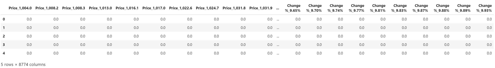
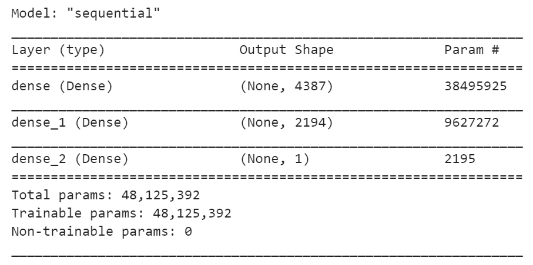
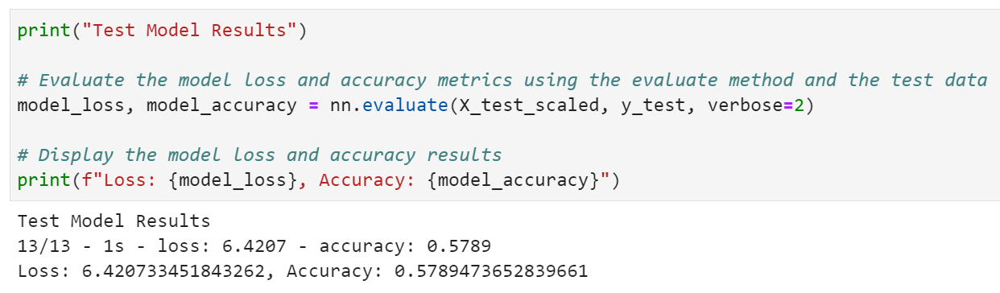
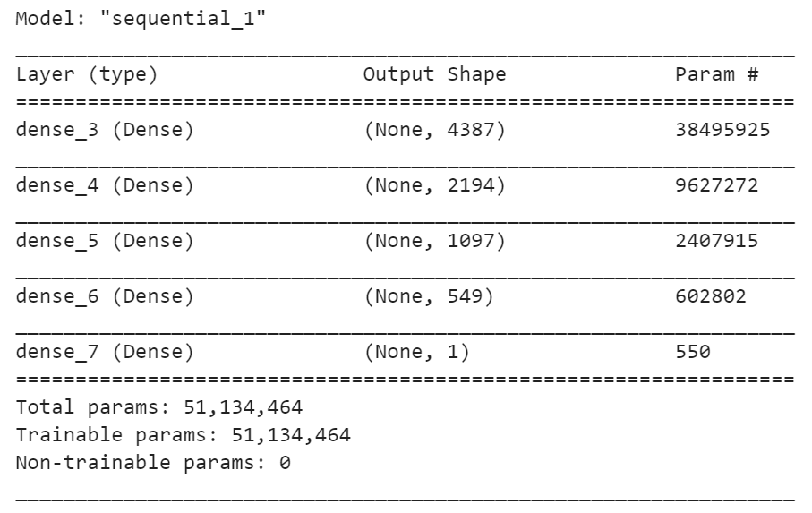
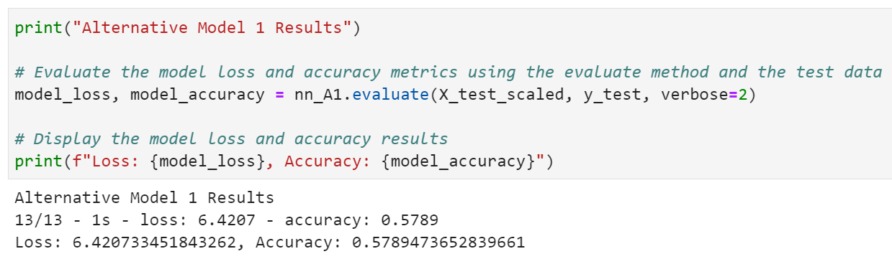

<h1 align="center">
  Machine Learning Algorithmic Trading Project 2
</h1>

<p align="center"></p>

Algorithmic trading relies on computer programs that execute algorithms to automate some or all elements of a trading strategy. Algorithms are a sequence of steps or rules designed to achieve a goal. They can take many forms and facilitate optimization throughout the investment process, from idea generation to asset allocation, trade execution, and risk management.

Machine learning (ML) involves algorithms that learn rules or patterns from data to achieve a goal such as minimizing a prediction error. The examples in this book will illustrate how ML algorithms can extract information from data to support or automate key investment activities. These activities include observing the market and analyzing data to form expectations about the future and decide on placing buy or sell orders, as well as managing the resulting portfolio to produce attractive returns relative to the risk.

Ultimately, the goal of active investment management is to generate alpha, defined as portfolio returns in excess of the benchmark used for evaluation. The fundamental law of active management postulates that the key to generating alpha is having accurate return forecasts combined with the ability to act on these forecasts (Grinold 1989; Grinold and Kahn 2000).


---

## Python Libraries

Before attempting to execute any Python code in machine_learning_algorithmic_trading_project_2.ipynb, it is helpful if your development environment holds the following modules:


- numpy [docs](https://github.com/numpy/numpy)
- pandas [docs](https://github.com/pydata/pandas)
- request [docs](https://docs.python-requests.org/en/master/)
- configparser [docs](https://docs.python.org/3/library/configparser.html)
- time [docs](https://docs.python.org/3/library/time.html)
- scipy [docs](https://github.com/scipy/scipy)
- scikit-learn [docs](https://scikit-learn.org/stable/user_guide.html)
- TensorFlow [docs](https://www.tensorflow.org/guide)
- PyTorch [docs](https://pytorch.org/docs/stable/index.html)
- matplotlib [docs](https://github.com/matplotlib/matplotlib)
- seaborn [docs](https://github.com/mwaskom/seaborn)
- statsmodels [docs](https://github.com/statsmodels/statsmodels)
- Machine Learning Financial Laboratory (mlfinlab) [docs](https://mlfinlab.readthedocs.io/en/latest/)

## Installation Guide

With your _Python 3.7+_ environment, run the following commands via CLI:

```
from datetime import datetime
import requests
import config
import pandas as pd
import time
```


---

## Examples

Test variables that were created using a one hot encoder instance


Summary description of the test model


Model accuracy / loss results for the test model


Summary description of the alternative model


Model accuracy / loss results for the alternative model


---

## Conclusion

Unfortunately, based upon the results of our test model, and alternative model, there is still room for further improvement based upon the accuracy and loss reported.

To further improve upon the model, we would like to posit the follwowing: 

* Can an increase in accuracy, and lowering in loss, be achievable by means of culling unnecessary data fed into the model ?

* Can the model be further improved upon by tying it to another asset of the same class (cryptpcurrency) with more stability / predictability ?

* Can the model be further improved upon by tying it to another asset of the differing class (stock, bond, etf, etc.) with more stability / predictability ?


---

## Contributors

New development created by [Brandon Chen](https://www.linkedin.com/in/brandon-chen-61334879/), [Debin Zou](https://www.linkedin.com/in/debinzou/), [Santiago Rosas](https://www.linkedin.com/in/ssrosas/), [Scientia Capital](https://www.linkedin.com/in/scientiacapital/) and Dr. FranQuantStein. Code from 'Initial commit' originates from ML for AlgoTrading - 2nd Edition.  We do not claim original ownership nor scholarship.

## Books

- [Advances in Financial Machine Learning](https://www.wiley.com/en-us/Advances+in+Financial+Machine+Learning-p-9781119482086), Marcos Lopez de Prado, 2018
- [Quantresearch](http://www.quantresearch.info/index.html) by Marcos López de Prado
- [Quantitative Trading](http://epchan.blogspot.com/), Ernest Chan
- [Machine Learning in Finance](https://www.springer.com/gp/book/9783030410674), Dixon, Matthew F., Halperin, Igor, Bilokon, Paul, Springer, 2020

## Machine Learning

- [Machine Learning](http://www.cs.cmu.edu/~tom/mlbook.html), Tom Mitchell, McGraw Hill, 1997
- [An Introduction to Statistical Learning](http://www-bcf.usc.edu/~gareth/ISL/), Gareth James et al.
    - Excellent reference for essential machine learning concepts, available free online
- [Bayesian Reasoning and Machine Learning](http://web4.cs.ucl.ac.uk/staff/D.Barber/textbook/091117.pdf), Barber, D., Cambridge University Press, 2012 (updated version available on author's website)

## License

Software tool available for public use. 
